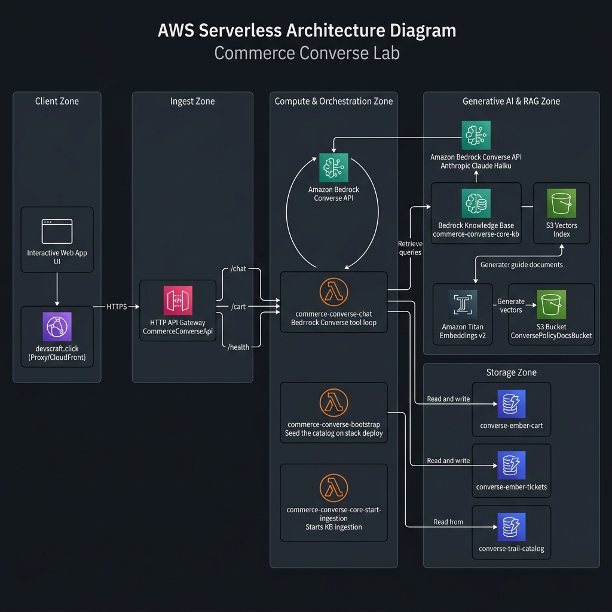

# Commerce Converse Lab

AI shopping assistant using **Bedrock Converse + a custom tool loop in Lambda** — low idle cost, full control over orchestration, tool calling, and confirmation gates.

---

## Architecture Diagram



[Open full-size diagram](aws_architecture_diagram.png)

---

## Architecture Overview

- **Bedrock Converse** (`Claude Haiku 4.5`) with a Python tool loop in Lambda — no Bedrock Agent service
- **DynamoDB** — catalog, cart, support tickets (on-demand billing)
- **Bedrock Knowledge Base + S3 Vectors** — store policy guides for `lookup_policies`
- **HTTP API** — `/chat`, `/cart/*`, `/health`

> **Frontend not in this repo.** The Next.js dev UI lives in `web/` (gitignored). The public demo is static HTML at [devscraft.click/projects/commerce-converse](https://devscraft.click/projects/commerce-converse).

---

## Project Structure

```
commerce-converse-lab/
├── README.md
├── .gitignore
├── converse-content/store-guides/   # Policy docs synced to S3 + KB
├── cdk/
│   ├── bin/cdk.ts
│   ├── lib/commerce-converse-core-stack.ts
│   ├── lambda/                      # chat handler, agent loop, tools, tests
│   └── cdk.json
└── web/                             # gitignored — local Next.js dev UI
    ├── app/
    └── lib/api.ts
```

---

## Stack Details — CommerceConverseCoreStack

| Resource | Description |
| :--- | :--- |
| **Lambda** | `commerce-converse-chat` — Bedrock Converse tool loop |
| **DynamoDB** | `converse-trail-catalog`, `converse-ember-cart`, `converse-ember-tickets` |
| **Bedrock KB** | S3 Vectors-backed policy retrieval |
| **HTTP API** | `CommerceConverseApi` |

Stack outputs after deploy:

- `ApiUrl` — HTTP API base URL (for `NEXT_PUBLIC_API_URL` in local dev)
- `HttpApiId` — set as `COMMERCE_CONVERSE_API_ID` in `my-portfolio-lab/cdk/lib/portfolio-stack.ts`
- `KnowledgeBaseId` — Bedrock KB for policy lookup

---

## Prerequisites

- **Node.js** 18+
- **AWS CDK CLI** 2.x
- **AWS CLI** configured with credentials
- **Bedrock model access** — enable Claude Haiku 4.5 in the Bedrock console

---

## Deployment

```bash
cd cdk
npm install
cdk bootstrap          # once per account/region
cdk deploy CommerceConverseCoreStack
```

Note the `ApiUrl` and `HttpApiId` outputs.

### Wire to portfolio site

1. Copy `HttpApiId` into `my-portfolio-lab/cdk/lib/portfolio-stack.ts` (`COMMERCE_CONVERSE_API_ID`).
2. Redeploy portfolio: `cd my-portfolio-lab/cdk && cdk deploy`
3. Live demo: [devscraft.click/projects/commerce-converse](https://devscraft.click/projects/commerce-converse)

With very low traffic (Haiku 4.5), expect roughly **$1–3/month** for light lab use; idle infra is ~$0–2/month.

---

## API Routes

| Method | Path | Description |
| :--- | :--- | :--- |
| GET | `/health` | Engine + KB status |
| POST | `/chat` | Converse loop (`utterance`, `shopperRef`, optional `transcript`, `confirmWrites`) |
| GET | `/cart` | Read cart for `shopperRef` query param |
| POST | `/cart/place` | Add line (`itemSku`, `cartQty`) |
| POST | `/cart/remove` | Remove line |
| POST | `/cart/clear` | Empty cart |

---

## Live Demo

The interactive demo at [devscraft.click/projects/commerce-converse](https://devscraft.click/projects/commerce-converse) uses CloudFront to:

- Serve static showcase HTML at `/projects/commerce-converse`
- Proxy `/converse-lab/*` to this stack's HTTP API (strips the `/converse-lab` prefix)

To iterate locally with the Next.js UI (private, not on GitHub):

```bash
cd commerce-converse-lab/web
npm install
# create .env.local with NEXT_PUBLIC_API_URL from stack ApiUrl output
npm run dev
```

Example `.env.local`:

```
NEXT_PUBLIC_API_URL=https://<api-id>.execute-api.us-east-1.amazonaws.com
```

---

## Cleanup

```bash
cd cdk && cdk destroy CommerceConverseCoreStack
```

